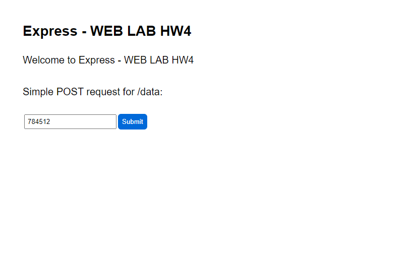
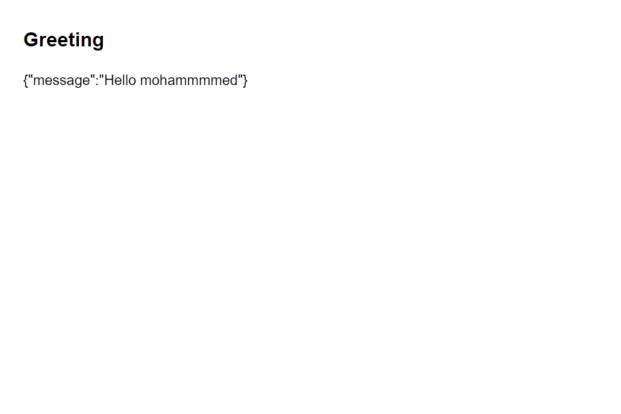
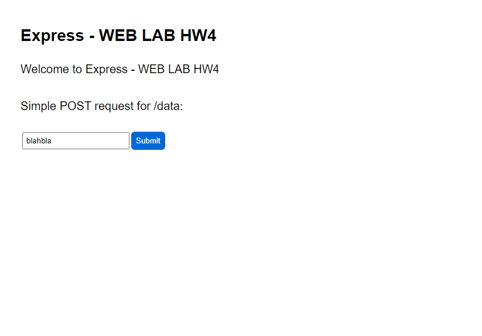
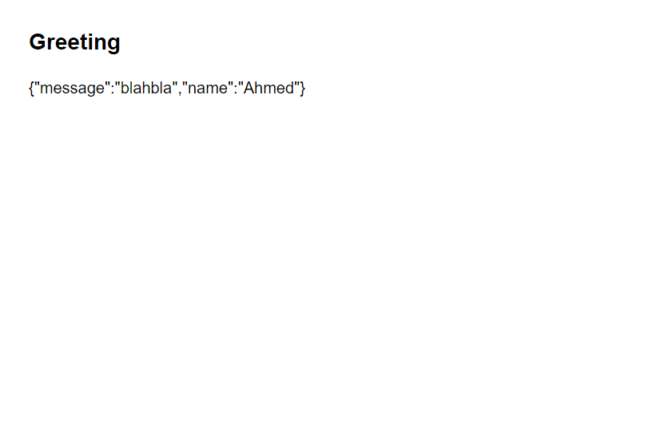
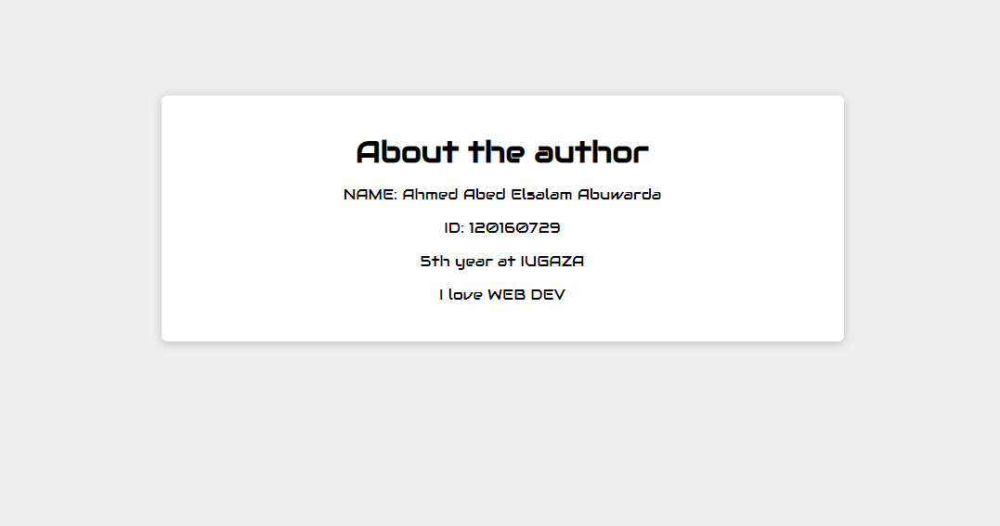

# Wep_Application_Lab_HW4:

**This is a simple app for `POST` and `GIT` methods using `Node.js` + `express.js`**

# How to use it?

### If you have `express.js` & `express-generator`:

1. Just clone the project.
2. Open `cmd` and head to the project file.
3. Type: `npm start` or `node ./bin/www`

**CMD EXAMPLE:**

```text
F:\Wep_Application_Lab_HW4\ECOM-5010-HW4> npm start
```

### If you do not have `express.js` & `express-generator`:

1. First you need to clone the repo.
2. You need to install `express.js` & `express-generator`.
   1. You can install `express.js` from [here](https://expressjs.com/en/starter/installing.html).
   2. Also you can install `express-generator` from [here](https://expressjs.com/en/starter/generator.html).
3. Run the project using: `npm start` like the previous one.

# Running Samples:

* Type in your browser: `http://localhost:1234/`
  

* For `GET` method type:

  * `http://localhost:1234/greeting`

    
  * `http://localhost:1234/greeting/<name>`
   


* For `POST` method type anything here:

 

* The result is:

 

# Finally `about.html` page:

* **Type on your browser: `http://localhost:1234/about.html`**
* The result is:



# `Thank you :)`